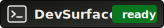
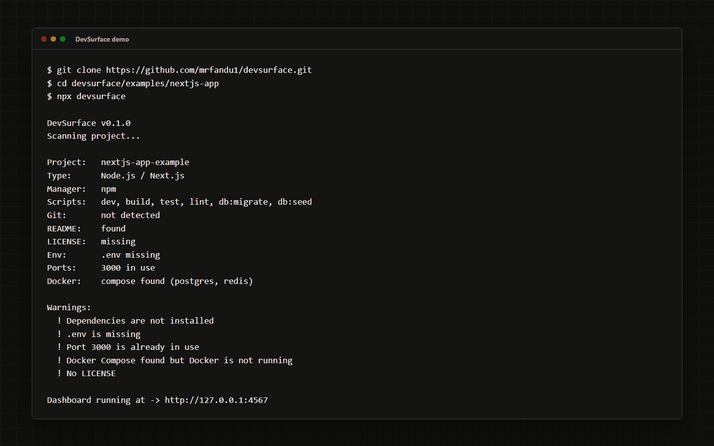

<!-- markdownlint-disable MD033 MD041 -->

<a id="readme-top"></a>

<div align="center">

<h1>DevSurface</h1>

<p><strong>Local developer dashboard for Node.js repositories.</strong></p>

<p>
  <a href="#quick-start">Quick Start</a>
  &nbsp;&middot;&nbsp;
  <a href="#commands">Commands</a>
  &nbsp;&middot;&nbsp;
  <a href="#dashboard">Dashboard</a>
  &nbsp;&middot;&nbsp;
  <a href="https://github.com/mrfandu1/devsurface/issues">Report an issue</a>
</p>

<p>
  <a href="https://github.com/mrfandu1/devsurface">
    
  </a>
  <a href="https://www.npmjs.com/package/devsurface">
    
  </a>
  <a href="https://www.npmjs.com/package/devsurface">
    
  </a>
  <a href="https://github.com/mrfandu1/devsurface/stargazers">
    
  </a>
  <a href="LICENSE">
    
  </a>
  
</p>

</div>

DevSurface is a zero-config CLI and local browser dashboard for understanding,
configuring, and running unfamiliar repositories. It detects Node.js package scripts,
Python, Go, Java, Rust, PHP, and Ruby project commands, Makefile / Justfile /
Taskfile / Deno tasks, environment files, occupied ports, Docker
Compose services, frameworks, live command logs, repo health checks, and
multi-workspace projects.

No global install, account, cloud service, or config file is required.

```bash
npx devsurface
```

With Bun:

```bash
bunx devsurface
```



## Why DevSurface

Most repositories explain setup with a few commands, but real onboarding usually
means checking env files, ports, Docker, package managers, scripts, and stale README
instructions. DevSurface puts that project surface in one local browser view so a
new contributor can see what is missing before guessing in the terminal.

DevSurface is local-first:

- Local runs bind to `127.0.0.1`.
- Docker and k3s runs bind inside the container and are meant to be exposed with
  local port mappings or `kubectl port-forward`.
- No accounts, cloud sync, telemetry, or analytics.
- `.env` values are never displayed.
- Commands are shown before they run.

## Use Cases

DevSurface is useful when you need to:

- Onboard contributors to an unfamiliar Node.js repository.
- Explore available npm, pnpm, Yarn, or Bun scripts.
- Check missing environment variables before starting a project.
- Detect local port conflicts.
- View and control Docker Compose services.
- Run development commands from a browser dashboard.
- Check repository onboarding health in GitHub Actions.
- Manage multiple local project workspaces.

## Supported Frameworks and Tools

DevSurface detects projects using:

- Meta-frameworks: Next.js, Nuxt, SvelteKit, Remix, Astro, Gatsby, Docusaurus,
  RedwoodJS
- UI libraries: React, Vue, Svelte, Solid, Angular
- Servers: Express, Fastify, NestJS, AdonisJS, Koa, hapi, Hono, tRPC
- Apps: Electron, Tauri, Expo, React Native
- Data and tooling: Prisma, Drizzle, Vite, Storybook, Tailwind CSS
- Monorepos: npm/yarn/bun workspaces, pnpm workspaces, Turborepo, Nx, Lerna
- Python: FastAPI/Uvicorn, Flask, Django
- Go modules
- Java: Maven and Gradle
- Rust (Cargo), PHP (Composer/Laravel), Ruby (Bundler/Rails)
- Docker Compose
- npm, pnpm, Yarn, and Bun

## How It Compares

| Tool                   | What it does                                         | Where DevSurface is different                                                                    |
| ---------------------- | ---------------------------------------------------- | ------------------------------------------------------------------------------------------------ |
| runme.dev              | Runs commands embedded in annotated README markdown. | Requires maintainers to annotate commands. DevSurface scans the repo without README annotations. |
| VS Code Tasks          | Runs tasks from `.vscode/tasks.json`.                | VS Code only and manually configured. DevSurface runs from `npx` and opens in any browser.       |
| Makefile / Taskfile    | Provides terminal task runners.                      | Terminal only. DevSurface adds UI, auto-detection, ports, env checks, logs, and health warnings. |
| npm-run-all            | Runs multiple npm scripts from the terminal.         | Script orchestration only. DevSurface shows the whole local project surface.                     |
| `package.json` scripts | Standard Node.js script entry points.                | No UI, env checks, port checks, service detection, or repo health context.                       |

DevSurface is not trying to replace these tools. It sits above them as a local control
panel for contributors who need to understand how a project is meant to run.

## Quick Start

Run DevSurface from the root of any Node.js project:

```bash
cd my-node-project
npx devsurface
```

Or, if you use Bun:

```bash
cd my-node-project
bunx devsurface
```

The dashboard opens at:

```text
http://127.0.0.1:4567
```

If a browser does not open automatically, copy the printed dashboard URL from the
terminal.

## Commands

Run DevSurface without installing it globally:

| Runtime | Command           |
| ------- | ----------------- |
| npm     | `npx devsurface`  |
| Bun     | `bunx devsurface` |

| Command                            | Description                                                             |
| ---------------------------------- | ----------------------------------------------------------------------- |
| `devsurface`                       | Scan the current project, start the dashboard, and open the browser.    |
| `devsurface scan`                  | Print detected project information (`--json`, `--markdown`).            |
| `devsurface ports`                 | Show project ports, what is using them, and free alternatives.          |
| `devsurface doctor`                | Print setup and repo health warnings (`--json`, `--fail-on`).           |
| `devsurface verify`                | Run the quality scripts (lint, typecheck, test, build) in sequence.     |
| `devsurface explain [script]`      | Explain package scripts in plain English (`--json`).                    |
| `devsurface summary`               | Explain the whole project in one plain-English paragraph (`--json`).    |
| `devsurface quickstart`            | Print a numbered first-run recipe with exact commands (`--json`).       |
| `devsurface tips`                  | Show friendly, project-aware tips for newcomers (`--json`).             |
| `devsurface learn [term]`          | Look up developer jargon in a 100-term plain-English glossary.          |
| `devsurface why "<error>"`         | Translate a scary error message into plain English (also via pipe).     |
| `devsurface system`                | Check whether this computer has the tools the project needs.            |
| `devsurface search <query>`        | Search scripts, env keys, ports, services, and the glossary at once.    |
| `devsurface notes`                 | Personal per-project notes and checklists (stored outside the repo).    |
| `devsurface todos`                 | List every TODO/FIXME/HACK comment left in the code.                    |
| `devsurface stats`                 | Code statistics: lines by language, largest files (`--json`).           |
| `devsurface deps`                  | Explain every installed dependency; `--licenses` for the rollup.        |
| `devsurface commits`               | Recent commits, contributors, and uncommitted changes, human-first.     |
| `devsurface clean`                 | Show reclaimable disk space; `--delete <name>` with confirmation.       |
| `devsurface snapshot [diff]`       | Freeze the project state; later ask "what changed since?".              |
| `devsurface bundle`                | Write a shareable, secret-free Markdown help bundle.                    |
| `devsurface scorecard`             | One A–F project health grade with the top things to improve (`--json`). |
| `devsurface secrets`               | Scan source for hardcoded credentials; values are always redacted.      |
| `devsurface scripts`               | Explain package scripts: call chains, hooks, portability issues.        |
| `devsurface activity`              | When the project gets worked on and which files change most (`--days`). |
| `devsurface deps-health`           | Heaviest, duplicate, unused, and phantom dependencies (offline).        |
| `devsurface tests`                 | Static test-suite read: counts, skips, `.only`, and coverage gaps.      |
| `devsurface configs`               | List config files and validate the JSON ones.                           |
| `devsurface bloat`                 | Large files, Git LFS candidates, and build output committed by mistake. |
| `devsurface links`                 | Verify every relative link in the Markdown docs resolves.               |
| `devsurface ci`                    | Explain CI pipelines and check they match the local scripts.            |
| `devsurface standup`               | Your recent commits grouped by day, plus work in progress (`--mine`).   |
| `devsurface release-notes`         | Draft release notes from commits since the last tag.                    |
| `devsurface readme`                | Grade the README and suggest what to add.                               |
| `devsurface env usage`             | Where each env variable is read, plus unused/undocumented keys.         |
| `devsurface watch`                 | Live terminal status: ports, services, health, every 5 seconds.         |
| `devsurface doctor --fix`          | Apply every safe automatic fix, then re-run the checkup.                |
| `devsurface completions <shell>`   | Tab-completion script for bash, zsh, or PowerShell.                     |
| `devsurface history`               | Show recent script runs recorded by the dashboard (`--json`).           |
| `devsurface badge`                 | Generate a setup-readiness SVG badge for the README.                    |
| `devsurface ports --free <port>`   | Stop the process occupying a port (with safety guardrails).             |
| `devsurface env check`             | Report missing/empty env keys; exits nonzero for CI (`--json`).         |
| `devsurface env sync`              | Append keys from `.env.example` missing in `.env` (never overwrites).   |
| `devsurface info`                  | Show version, data locations, and workspace count.                      |
| `devsurface status`                | Check whether a local hub is running (version, uptime, workspaces).     |
| `devsurface init`                  | Create a starter `devsurface.config.json`.                              |
| `devsurface passport`              | Generate a shareable HTML onboarding report (Project Passport).         |
| `devsurface run [script]`          | Run a package script (interactive picker when omitted).                 |
| `devsurface up`                    | Run the launch sequence: Docker services, then the dev script.          |
| `devsurface upgrade`               | Check the npm registry for a newer DevSurface release.                  |
| `devsurface serve`                 | Start the multi-workspace hub server.                                   |
| `devsurface workspace add [path]`  | Register a project directory with the local hub.                        |
| `devsurface workspace list`        | List registered hub workspaces.                                         |
| `devsurface workspace remove <id>` | Remove a workspace from the hub registry.                               |
| `devsurface workspace prune`       | Remove workspaces whose directories no longer exist.                    |

## Project Passport

Some people who need to run a project will never open a terminal happily: a
designer checking a prototype, a PM reviewing a feature, a student cloning their
first repo. Project Passport is for them — and for the developer who would
otherwise write the same "how to run this" message again and again.

```bash
npx devsurface passport
```

This writes `devsurface-passport.html`: a single self-contained page that works
offline in any browser and explains the project in plain English:

- What the project is (framework, languages, services).
- Step-by-step "get it running" instructions with exact copy-paste commands.
- Every package script explained in one friendly sentence.
- Environment keys the project needs (names only — values are never included).
- Ports, Docker services, and repo health warnings.

Share it in chat, email it to a new contributor, or commit it as living
onboarding docs. The dashboard has a matching **Passport** quick action, and the
API serves it at `/api/workspaces/:id/passport`.

## Multi-Workspace Hub

DevSurface now runs as a local hub. One server can serve several project
directories, each with isolated process state, Docker controls, logs, and scanner
results.

Start or attach from any project:

```bash
npx devsurface
```

Run a persistent hub:

```bash
npx devsurface serve --no-open
```

Register workspaces manually:

```bash
npx devsurface workspace add /path/to/project-a
npx devsurface workspace add /path/to/project-b
npx devsurface workspace list
```

Container and k3s deployments are included for local-cluster use:

- `Dockerfile`
- `docker-compose.hub.yml`
- `deploy/k3s/`

Container deployments bind inside the container. Keep host port mappings local,
for example `127.0.0.1:4567:4567`, or use `kubectl port-forward` for k3s.

## GitHub Action

DevSurface can check repository onboarding health on every pull request without
installing dependencies or running project scripts.

```yaml
name: DevSurface

on:
  pull_request:
  push:
    branches: [main]

permissions:
  contents: read
  pull-requests: write

jobs:
  health:
    runs-on: ubuntu-latest
    steps:
      - uses: actions/checkout@v4
      - uses: mrfandu1/devsurface@v0
        with:
          fail-on: error
```

The action always emits workflow annotations and a Markdown job summary. On pull
requests it also creates or updates one DevSurface comment when the workflow token
has `pull-requests: write`. Fork pull requests normally receive a read-only token;
in that case the action keeps the annotations and summary and skips the comment.

Inputs:

| Input          | Default | Description                                                     |
| -------------- | ------- | --------------------------------------------------------------- |
| `path`         | `.`     | Repository-relative directory to check.                         |
| `fail-on`      | `error` | Fail on `error`, `warning`, or never fail with `never`.         |
| `comment`      | `true`  | Create or update a pull request comment when permissions allow. |
| `github-token` | token   | Token used only for pull request comments.                      |

The repository checks are intentionally static. They do not install dependencies,
run package scripts, inspect local ports, require a real `.env`, or contact Docker.

## What It Detects

| Area            | Detection                                                                  |
| --------------- | -------------------------------------------------------------------------- |
| Project         | `package.json`, project name, README, LICENSE                              |
| Package manager | npm, pnpm, yarn, bun from lock files                                       |
| Scripts         | `package.json` scripts                                                     |
| Environment     | `.env`, `.env.example`, missing and empty keys without values              |
| Ports           | Configured, inferred, and occupied ports using Node's `net` module         |
| Docker          | Compose files, daemon status, service state, controls, and logs            |
| Git             | Branch, changed files, ahead/behind upstream, last commit, remote          |
| Monorepo        | npm/yarn/bun/pnpm workspaces, Turborepo, Nx, Lerna, and member packages    |
| Dependencies    | Runtime/dev counts and stale-lockfile detection                            |
| Toolchain       | Test runner, linter, formatter, bundler, ORM, styling, CI, git hooks, TS   |
| Node version    | Required Node from `engines.node`, `.nvmrc`, or `.node-version`            |
| README          | Quick-start commands from fenced shell blocks, surfaced in onboarding      |
| Project facts   | License type, commit count, latest tag, CHANGELOG, community docs, tests   |
| Framework       | 29 frameworks, from Next.js and Astro to Electron, Tauri, and Tailwind CSS |

## Dashboard

Press <kbd>Ctrl</kbd>+<kbd>K</kbd> (or <kbd>Cmd</kbd>+<kbd>K</kbd>) anywhere in the
dashboard to open the command palette: fuzzy-search views, package scripts with
plain-English explanations, quick actions, and workspaces, and run the selection
without touching the mouse.

The dashboard follows your system light/dark preference; use the topbar toggle or
the Theme setting to override it. Settings, pinned scripts, and the sidebar
state persist across reloads, and the dashboard rescans instantly when
package.json, .env, or Compose files change on disk.

The dashboard includes:

- **Project Overview**: project name, framework, package manager, git status
  (branch, changed files, ahead/behind, last commit), monorepo and dependency
  summaries, env, README, and license status.
- **Quick Actions**: compact direct actions for scripts, terminal, project folder,
  code editor, `package.json`, and dependency install.
- **Scripts**: every package script with a search box, grouped configured
  commands, and a Recent Runs list (recorded locally, never in the repo).
- **Environment**: `.env` and `.env.example` status, key presence, copy-from-example,
  and write-only quick-fill for missing keys (values are never displayed).
- **Ports**: detected ports with availability, conflict warnings, the name +
  PID of the process occupying a busy port, and a confirmed one-click "Free"
  action that stops it.
- **Services**: Docker Compose daemon state, per-service status, start/stop controls,
  and the latest 200 log lines for each service.
- **Logs**: expandable per-command logs with timestamps, streams, exit state,
  text/stream filters, and a download button.
- **Repo Health**: doctor warnings for common setup issues.

Quick Actions intentionally stay compact. Long script lists belong in the Scripts
page, where they have room to breathe.

## Optional Config

DevSurface works without configuration. Maintainers can add `devsurface.config.json`
when a project needs richer commands, groups, ports, env paths, or docs links.

```json
{
  "name": "My App",
  "description": "Full-stack SaaS starter",
  "commands": {
    "install": "pnpm install",
    "dev": "pnpm run dev",
    "build": "pnpm run build",
    "test": "pnpm test",
    "lint": "pnpm run lint"
  },
  "groups": {
    "Setup": ["install"],
    "Development": ["dev"],
    "Quality": ["test", "lint"],
    "Build": ["build"]
  },
  "ports": [3000, 5432, 6379],
  "env": {
    "example": ".env.example",
    "local": ".env"
  },
  "services": {
    "docker": true
  },
  "docs": "https://docs.example.dev"
}
```

Configured commands appear on the Scripts page. If `groups` is present, DevSurface
uses those group names. Commands not listed in a group still appear under
Configured Commands. The `docs` URL appears as a Project docs link.

A `launch` array defines the one-command startup order — `"docker"` starts the
Compose services, any other entry names a package script or configured command:

```json
{
  "launch": ["docker", "db:migrate", "dev"]
}
```

Run it with `devsurface up` (or `--dry-run` to preview), or the dashboard's
Launch quick action. `devsurface init` prefills the whole config, including the
launch sequence, from what the scanner detects.

## Badge

Maintainers can add this badge to a project README after checking that DevSurface
works for the repo:

```markdown
[](https://github.com/mrfandu1/devsurface)
```

DevSurface can also generate a live setup-readiness badge from the onboarding
score (`devsurface-readiness.svg`, shields.io style):

```bash
npx devsurface badge
```

## Safety

DevSurface is designed for local development.

- Local dashboard servers bind to loopback hosts.
- Container deployments use `DEVSURFACE_CONTAINER=true`.
- Workspace registration can be limited with `DEVSURFACE_WORKSPACE_ROOTS`. In container
  or shared-host deployments, set this to restrict which directories the hub will accept;
  on a single-user laptop it is optional and DevSurface starts with no extra config.
- `.env` values are never returned by scanners, API routes, CLI output, or UI panels.
- Dashboard command runs show the exact command string first.
- Docker service start and stop actions show the exact Compose command before running.
- Freeing a busy port always shows which process will be stopped and asks for
  confirmation first; system processes and DevSurface itself are never killed.
- Destructive-looking configured commands, such as `rm -rf`, `docker volume rm`,
  database drops, and `git clean -fd`, are visibly marked before execution. This list is a
  helpful warning, not a sandbox: it flags common footguns for confirmation but does not
  attempt to detect every dangerous command. Treat package scripts as code that runs as you.
- Child processes started by DevSurface are cleaned up when the dashboard exits.

## FAQ

### What is DevSurface?

DevSurface is a local developer dashboard for understanding, configuring, and running
Node.js repositories.

### Can DevSurface run npm scripts from a browser?

Yes. DevSurface detects `package.json` scripts and lets you run them while viewing
live logs and exit status.

### Does DevSurface display .env values?

No. DevSurface checks whether environment keys exist, but never displays their values.

### Does DevSurface require configuration?

No. It works automatically, with an optional `devsurface.config.json` file for richer
commands, groups, ports, env paths, and docs links.

### Does DevSurface support Docker Compose?

Yes. It detects Compose services and provides service status, controls, and recent logs.

## Examples

This repository includes two sample projects:

```bash
cd examples/node-basic
node ../../dist/cli/index.js

cd examples/nextjs-app
node ../../dist/cli/index.js
```

The Next.js example is used for the README demo: it has six scripts, `.env.example`,
Docker Compose, and a port conflict scenario.

## Development

```bash
npm install
npm run build
npm test
```

Useful commands:

| Command                | Description                               |
| ---------------------- | ----------------------------------------- |
| `npm run dev`          | Run the local DevSurface CLI from source. |
| `npm run build:web`    | Build the React dashboard with Vite.      |
| `npm run build:cli`    | Build the CLI with tsup.                  |
| `npm run typecheck`    | Run TypeScript without emitting files.    |
| `npm run lint`         | Run ESLint.                               |
| `npm run format:check` | Check Prettier formatting.                |

Before opening a pull request, run:

```bash
npm run format:check
npm run typecheck
npm run lint
npm test
npm run build
```

## Contributing

Contributions of every kind are welcome: code, documentation, bug reports,
examples, and reviews. Start with [CONTRIBUTING.md](CONTRIBUTING.md) for the
development workflow.

## License

DevSurface is released under the MIT License. See [LICENSE](LICENSE) for the full
text. Copyright (c) 2026 DevSurface contributors.

## Contact and community

- GitHub Issues: report bugs and request features through
  [GitHub Issues](https://github.com/mrfandu1/devsurface/issues).
- Security: report vulnerabilities through [SECURITY.md](SECURITY.md).

[(back to top)](#readme-top)
